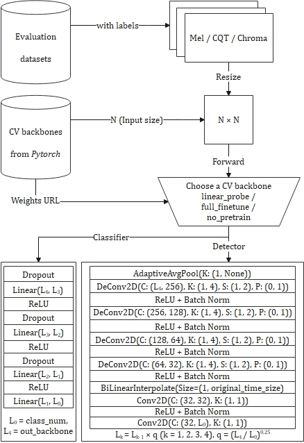

# Evaluation Framework for CCMusic Database Detection Task
[](https://github.com/monetjoe/ccmusic_eval/blob/main/LICENSE)
[](https://github.com/monetjoe/ccmusic_eval/actions/workflows/python-app.yml)
[](https://huggingface.co/ccmusic-database)
[](https://www.modelscope.cn/organization/ccmusic-database)
[](https://arxiv.org/pdf/2503.18802.pdf)
[](https://doi.org/10.5334/tismir.194)

Detect spectrograms by fine-tuned pre-trained CNN models.



## Download
```bash
git clone -b tech99 git@github.com:monetjoe/ccmusic_eval.git
cd ccmusic_eval
```

## Environment
```bash
conda create -n py311 python=3.11 -y
conda activate py311
pip install -r requirements.txt
```

### Fixed Hyper Params
|     Param      | Value |   Range   |
| :------------: | :---: | :-------: |
|   iteration    |  10   |   train   |
|       lr       | 0.001 | optimizer |
|    momentum    |  0.9  | optimizer |
|   optimizer    |  SGD  | scheduler |
|      mode      |  min  | scheduler |
|     factor     |  0.1  | scheduler |
|    patience    |   5   | scheduler |
|    verbose     | True  | scheduler |
|   threshold    |  lr   | scheduler |
| threshold_mode |  rel  | scheduler |
|    cooldown    |   0   | scheduler |
|     min_lr     |   0   | scheduler |
|      eps       | 1e-08 | scheduler |

## Cite
```bibtex
@article{Zhou-2025,
  author  = {Monan Zhou and Shenyang Xu and Zhaorui Liu and Zhaowen Wang and Feng Yu and Wei Li and Baoqiang Han},
  title   = {CCMusic: An Open and Diverse Database for Chinese Music Information Retrieval Research},
  journal = {Transactions of the International Society for Music Information Retrieval},
  volume  = {8},
  number  = {1},
  pages   = {22--38},
  month   = {Mar},
  year    = {2025},
  url     = {https://doi.org/10.5334/tismir.194},
  doi     = {10.5334/tismir.194}
}
```
